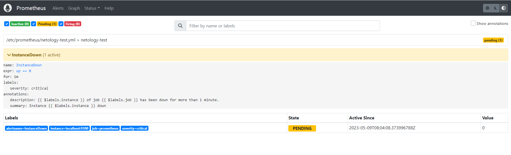
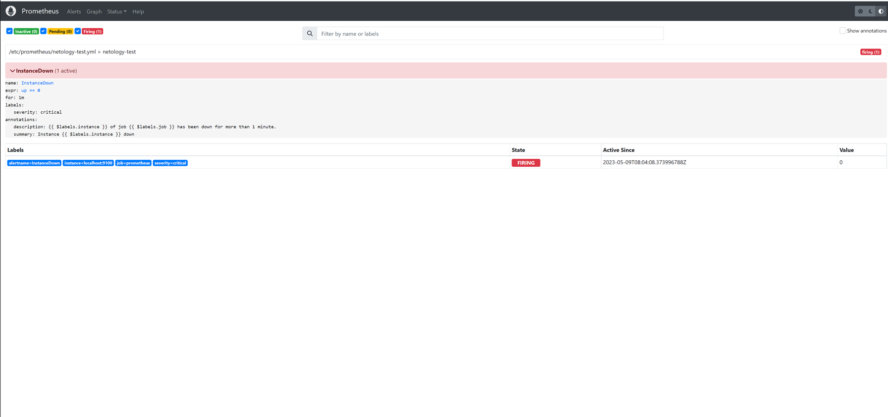
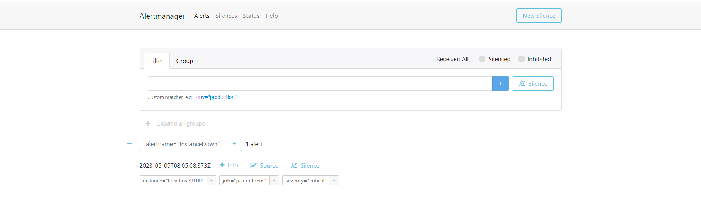
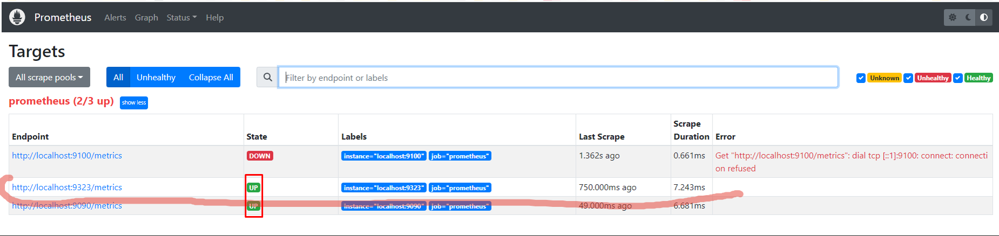
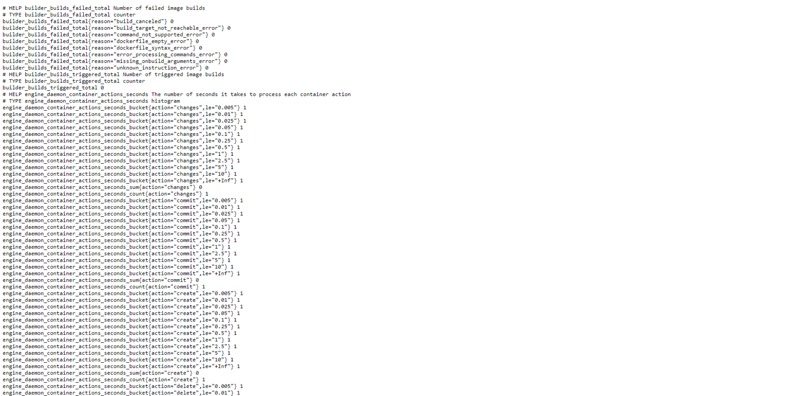

# Домашнее задание к занятию «Система мониторинга Prometheus. Часть 2»" - `Мильдзихов Сергей`

### Задание 1

Создайте файл с правилом оповещения, как в лекции, и добавьте его в конфиг Prometheus.

### Требования к результатам

Погасите node exporter, стоящий на мониторинге, и прикрепите скриншот раздела оповещений Prometheus, где оповещение будет в статусе Pending

### Решение

---

### Задание 2

Установите Alertmanager и интегрируйте его с Prometheus.

### Требования к результатам

Прикрепите скриншот Alerts из Prometheus, где правило оповещения будет в статусе Fireing, и скриншот из Alertmanager, где будет видно действующее правило оповещения

### Решение

---

### Задание 3

Активируйте экспортёр метрик в Docker и подключите его к Prometheus.

### Требования к результатам

приложите скриншот браузера с открытым эндпоинтом, а также скриншот списка таргетов из интерфейса Prometheus.*

### Решение

